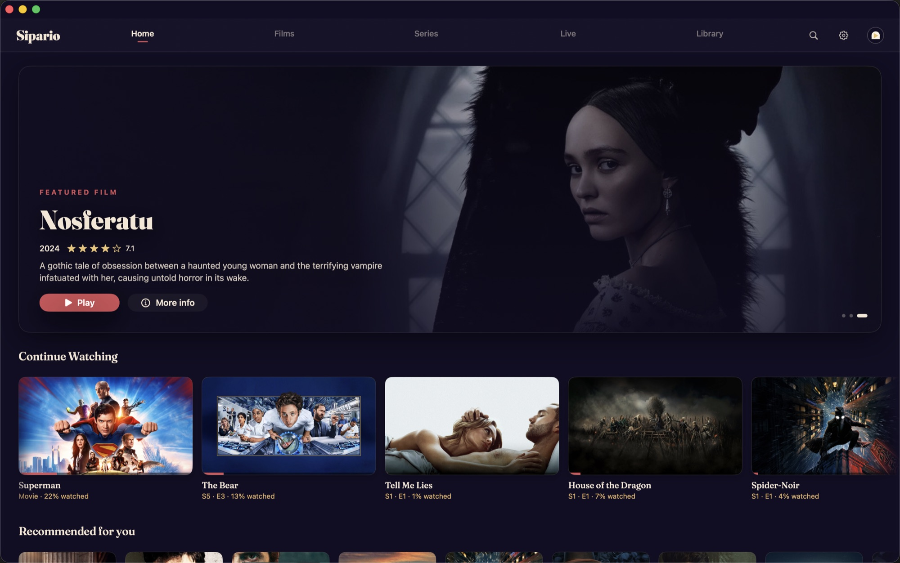
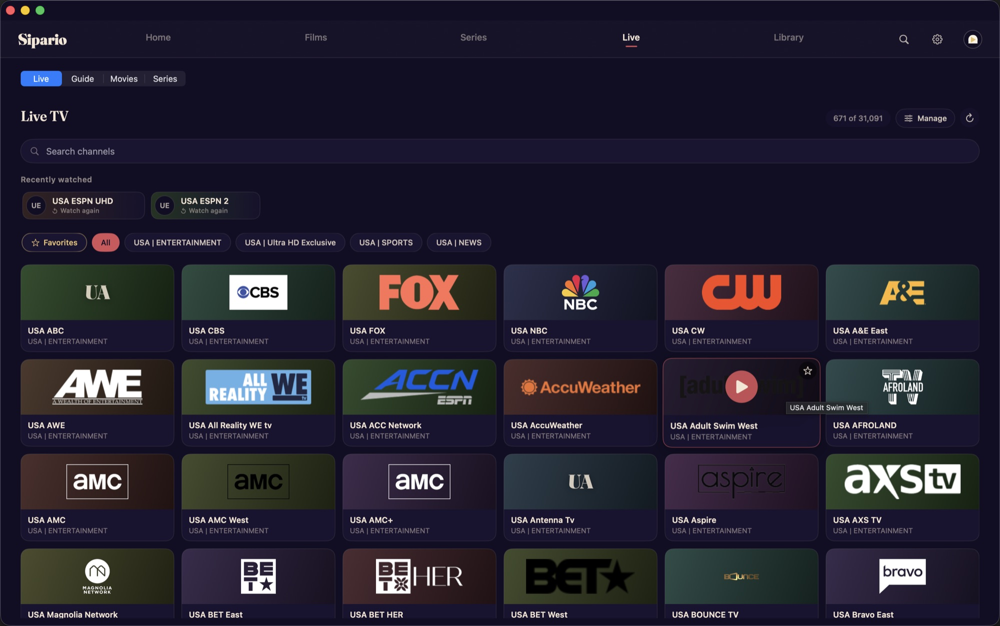
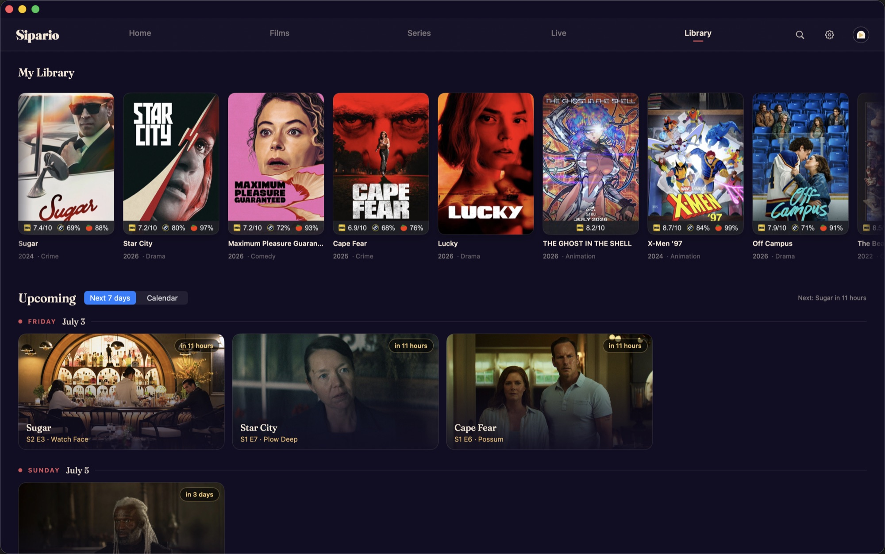
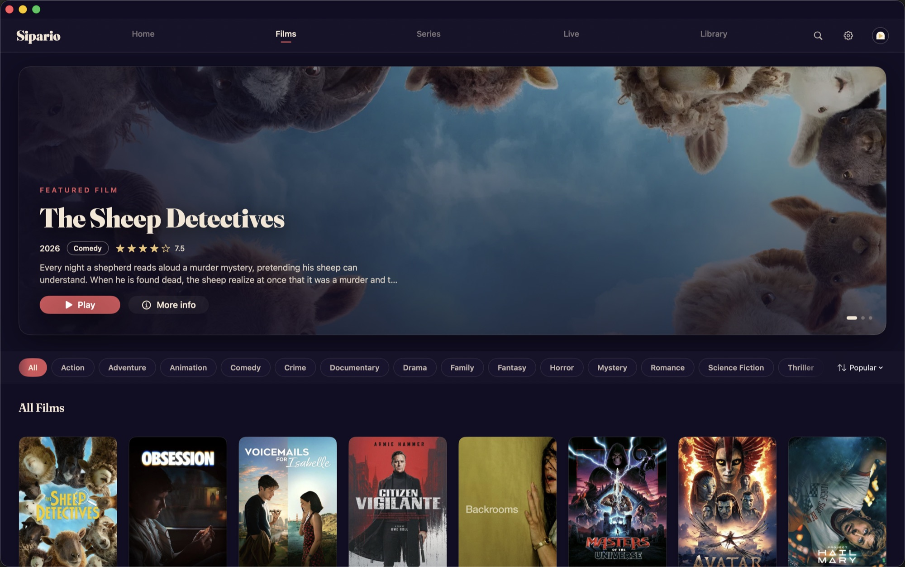
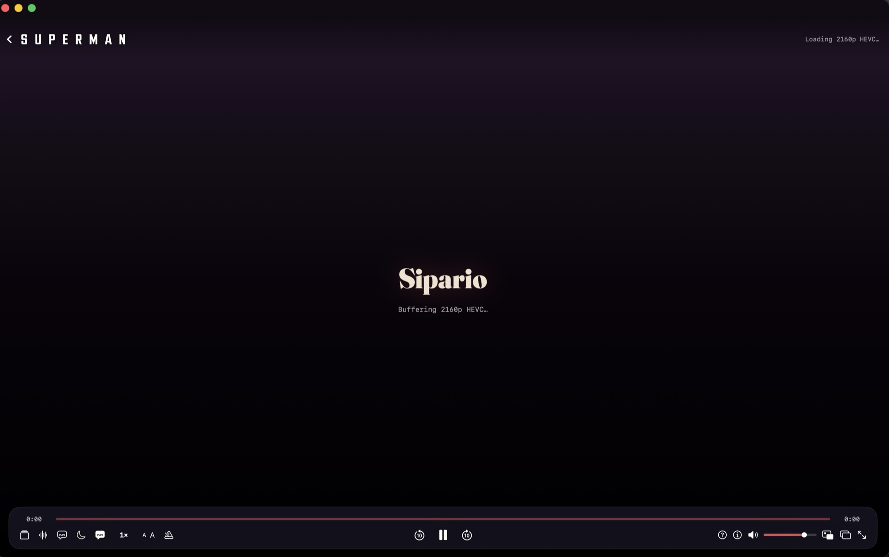
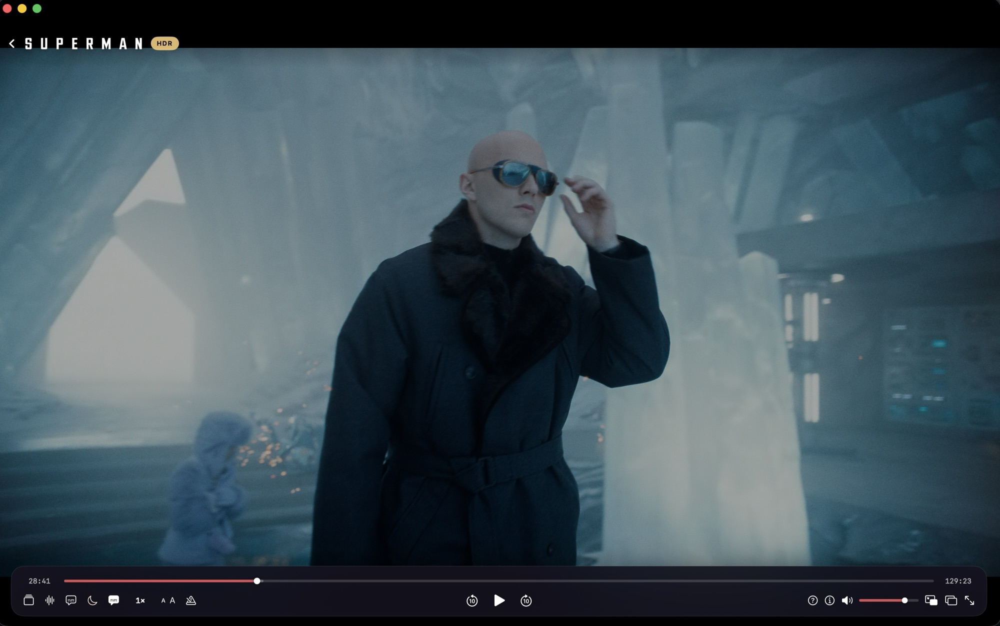

<p align="center">
  <a href="https://sipario.tv">
    
  </a>
</p>

<h1 align="center">Sipario Releases</h1>

<p align="center">
  <strong>Native playback for sources you bring.</strong><br>
  macOS &nbsp;·&nbsp; Windows &nbsp;·&nbsp; Android TV
</p>

This repository is the public release shelf for Sipario. It intentionally does
not contain the development source tree; active development stays in the private
`Aiml3ss/sipario` repo while binaries ship here.

Sipario pairs streaming-app convenience with local-player fidelity: native UI,
native hardware decode, broad codec support, exact resume, and no server-side
transcoding requirement.

## Downloads

<!-- versions:table:begin (auto-generated by .github/workflows/update-readme.yml — do not edit by hand) -->
| Platform | Current Download | Version | Release Notes |
|---|---|---|---|
| macOS desktop | [Download the DMG](https://sipario.tv/download/mac) | 0.54.0 | [macos-v0.54.0](https://github.com/Aiml3ss/sipario-releases/releases/tag/macos-v0.54.0) |
| Windows desktop **(alpha)** | [Download the MSI](https://sipario.tv/download/windows) | 0.2.0 | [windows-v0.2.0](https://github.com/Aiml3ss/sipario-releases/releases/tag/windows-v0.2.0) |
| Android TV | [Download the APK](https://sipario.tv/download/tv) | 1.19.0 | [android-tv-v1.19.0](https://github.com/Aiml3ss/sipario-releases/releases/tag/android-tv-v1.19.0) |
<!-- versions:table:end -->

> [!WARNING]
> **Windows is an early alpha.** It runs, but it is rough — expect bugs,
> rough edges, and the occasional crash. macOS and Android TV are the mature,
> day-to-day apps; the Windows build is young and catching up fast. If that is
> not for you yet, grab the Mac or TV app instead. Anything broken? Please file
> it in [Issues](https://github.com/Aiml3ss/sipario-releases/issues) — that
> is exactly what moves it toward stable. (It is also unsigned, so SmartScreen
> will warn on first run.)

Stable website links:

- <https://sipario.tv/download/mac>
- <https://sipario.tv/download/windows>
- <https://sipario.tv/download/tv>

On the TV itself: open the **Downloader** app and enter code **5358756**.

## Why Sipario Is Different

Sipario starts with playback rather than a hosted catalog or transcoding server.
The goal is simple: open your source quickly, keep its original quality, and make
the hard formats behave like ordinary video.

### Real-time Dolby Vision Profile 7 → Profile 8.1

Android TV can convert a Dolby Vision Profile-7 MKV into Profile 8.1
**on the box, while it plays**. This is NAL-level bitstream surgery, not a video
transcode:

- the device's hardware Dolby Vision profiles are probed before routing;
- the original HEVC base layer stays compressed and untouched;
- per-frame Dolby Vision RPU metadata is rewritten from P7 to P8.1;
- the enhancement layer is removed, with no decode/re-encode generation loss;
- the result is streamed to the TV box's native Profile-8 hardware decoder;
- converter-aware seek, resume, buffering, and automatic mpv/HDR10 fallback keep
  the title playable if the hardware path fails.

That lets a Profile-7 MKV trigger real Dolby Vision on supported boxes that can
decode Profile 8 but reject Profile 7—instead of quietly showing only the darker
HDR10-compatible base layer.

> [!NOTE]
> P7 → P8.1 conversion is Android-TV-only, opt-in under Settings, and verified on
> the onn 4K Plus. Dolby Vision behavior still depends on the TV, box, firmware,
> and HDMI chain.

### Playback work beyond a stock player

| Capability | What Sipario does |
|---|---|
| **Per-title engine routing** | Android TV chooses native mpv for the broadest format coverage or Media3/MediaCodec for true hardware Dolby Vision, then falls back automatically when a path fails. |
| **Network-first reliability** | Parallel ranged reads, bounded buffers, reconnect/resume logic, source re-resolution, and converter-specific open-GOP handling keep large 4K network files moving on low-cost hardware. |
| **Subtitle matching** | Embedded and add-on subtitles are ranked against the exact release and content fingerprint—not only language—then remembered across pause, seek, resume, and later episodes. PGS/VobSub bitmap subtitles also render on the Android Dolby Vision path. |
| **Audio sink honesty** | TrueHD, DTS-HD, AC-3, E-AC-3/Atmos, and other formats decode to multichannel PCM by default. Optional passthrough is limited to formats the connected HDMI sink actually advertises; unsupported formats fall back to PCM. |
| **Exact continuity** | Continue Watching stores the exact title, episode, source, subtitle choice, and position. Optional Trakt sync updates on launch; encrypted Sipario pairing moves library state between devices without a Sipario account. |
| **Source intelligence** | Streams are parsed, scored, and ranked by resolution, codec, HDR, audio, size, cache status, and source health before playback starts. |

## Built for Actual Watching

- **Persistent playback speed.** Set a default—including 1.5×—and every new
  video starts there across both Android TV playback engines. Speed remains
  adjustable inside the player.
- **Binge controls.** Chapters, Skip Intro/Recap/Credits, Up Next, Start Over,
  exact resume, and Continue Watching actions are built in.
- **Real subtitle control.** Preferred language, exact-track memory, forced/SDH
  awareness, subtitle delay, size, color, style, and vertical position.
- **A useful player HUD.** Audio/subtitle/display panels, codec and HDR info,
  buffering and link-speed feedback, aspect-ratio Fit/Stretch/Zoom, and
  stats-for-nerds diagnostics.
- **Fast discovery.** Unified search across metadata and add-on catalogs, genre
  filters, voice search on TV, cast/studio detail, ratings, trailers, favorites,
  and recommendations that learn on-device.
- **Serious live TV.** M3U and Xtream sources, XMLTV guide data, favorites,
  recent channels, search, A–Z sorting, category management, an in-player guide,
  and QR-assisted setup.
- **Self-updates.** macOS, Windows, and sideloaded Android TV builds check for new
  releases without making users reinstall from scratch.

## Native on Every Platform

| Platform | Native stack | Highlights |
|---|---|---|
| **macOS** | SwiftUI + libmpv/gpu-next | Hardware decode, HDR pipeline, picture-in-picture, thumbnail scrubbing, on-device Whisper subtitle generation, menu-bar and keyboard control, self-update. |
| **Android TV** | Jetpack Compose + libmpv + Media3 | Remote-first 10-foot UI, per-title engine routing, real hardware Dolby Vision, P7 → P8.1 conversion, 4K HEVC/AV1, sink-gated audio passthrough, voice search, ambient mode, self-update. |
| **Windows (alpha)** | Dioxus/Blitz + libmpv | Shared Rust source engine, native desktop player, hardware decode, HDR10 through D3D11, live TV, library/pairing, keyboard-first controls, self-update. |

The apps share a Rust core for source parsing, stream ranking, metadata, live-TV
inputs, skip markers, and safety checks while keeping each platform's playback
surface native.

## Your Sources, Your Data

Sipario supports user-supplied Stremio-compatible add-ons, M3U/Xtream live-TV
sources, local files and URLs, and personal-library bridges such as Plex or
Jellyfin where available. Sipario hosts no media, bundles no piracy catalog, and
requires no Sipario account. Trakt integration is optional.

## Screenshots

_Desktop app (macOS). Browse, live TV, library, and the native player._

| | |
|---|---|
|  |  |
|  |  |

The player — frosted control bar, live HDR badge, in-player menus:



Full-quality playback through the native mpv pipeline:



## Install Notes

### macOS

Download `Sipario-macos.dmg`, open it, and drag Sipario into Applications.

The current macOS build is not Apple-notarized yet. On first launch, use
Control-click -> Open, or clear the quarantine flag:

```bash
xattr -dr com.apple.quarantine /Applications/Sipario.app
```

### Windows

**Alpha — early and rough.** Fine for the curious and for feedback; not yet the
smooth experience the Mac and TV apps are.

Download `Sipario-windows.msi` and run it (per-user install, no admin needed).

The current Windows build is not Authenticode-signed yet, so Microsoft
Defender SmartScreen will warn on first run. Click **More info -> Run anyway**.
After the first install the app checks for updates itself.

### Android TV

Download `Sipario-TV.apk` and sideload it on an Android TV or Google TV device.

With adb:

```bash
adb install -r Sipario-TV.apk
```

<!-- versions:apk-note:begin -->
The current APK is version `1.19.0`.
<!-- versions:apk-note:end -->
After the first install the app checks for updates itself, so later versions
arrive without another manual sideload.

## Checksums

<!-- versions:checksums:begin -->
```text
Sipario-macos.dmg (macos-v0.54.0)
sha256 fe84e0728e72cc6f058064379f7342e43156b8e7cf9f3c06a6dffea0dd503cd9

Sipario-windows.msi (windows-v0.2.0)
sha256 53adb33c8a8065740d31cee5828dc27f2c61793512febb23a6e51047da6a3dc2

Sipario-TV.apk (android-tv-v1.19.0)
sha256 eda1799346e2f9e8d8eb585cf1157fb15b67b9b8084e84725f0f8e6c44e970df
```
<!-- versions:checksums:end -->

## Feedback

Use [Issues](https://github.com/Aiml3ss/sipario-releases/issues) for install
problems, broken downloads, or playback reports from a released build. Include
your platform, app version, device model, and what happened when you pressed
Play.
